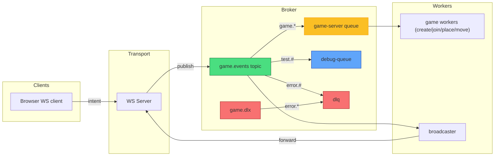

# RabbitShip ⚓ Real-Time Battleship with RabbitMQ

RabbitShip is a message-driven real-time multiplayer battleship game using RabbitMQ for pub/sub messaging and WebSockets for client communication.

## Motivation

RabbitShip demonstrates modern real-time game architecture using industry-standard tools:

- **Message-Driven Design**: Decouples game logic from network transport, enabling horizontal scaling
- **Event Sourcing**: All game state changes are published as immutable events
- **Server Authority**: Game engine runs on server, preventing client-side cheating
- **Learning Resource**: A practical example of pub/sub messaging, WebSocket integration, and distributed systems patterns

## Core Architecture

The system follows a microservices pattern with these key components:

1. HTTP Server - Entry point and static file serving
2. WebSocket Server - Real-time client communication (src/server/ws/)
3. RabbitMQ Message System - Event pub/sub backbone (src/server/rabbit/)
4. Worker Handlers - Business logic processors (src/server/worker/)
5. Game Engine - Game state management (src/game/)

## Event Flow Pattern

Client → Server → Worker → Client:

1. Client sends WebSocket message
2. WS server validates → publishes to RabbitMQ
3. RabbitMQ routes to appropriate worker queue
4. Worker processes business logic
5. Worker publishes result event
6. Broadcaster forwards to relevant WebSocket clients

RabbitMQ setup diagram:



## Key Architecture Features

**Message System (`src/server/rabbit/`):**

- Topic exchange with wildcard routing (game.\*, error.#)
- MessagePack serialization for efficient binary payloads
- Publisher confirms guaranteeing delivery
- Dead letter queues for failed messages
- Singleton connection with auto-reconnection

**WebSocket Integration (`src/server/ws/`):**

- Unique WS ID assignment and game mapping
- Input validation for all payloads
- Exclusive broadcaster queue for real-time updates

**Worker Processing (`src/server/worker/`):**

- Game Worker - Game creation/joining
- Placement Worker - Ship placement validation
- Move Worker - Shot resolution and game logic
  This design provides excellent scalability, reliability, and real-time performance through proper separation of concerns and message-driven architecture.

## Quick Start

Get RabbitShip running in under 5 minutes:

```bash
# 1. Clone and install
git clone https://github.com/colineckert/rabbitship.git
cd rabbitship
npm install

# 2. Start RabbitMQ
docker-compose up -d rabbitmq

# 3. Build and run server
npm run build
npm run server

# 4. Open the game
open http://localhost:3000
```

Two browsers are recommended for local testing — one for each player.

## Run Locally

```bash
docker compose up --build
```

### Quick Dev Run (recommended)

Prereqs: Docker (for RabbitMQ) and Bun (server runtime). Node/npm for client build.

1. Start RabbitMQ:

```bash
docker-compose up -d rabbitmq
# visit RabbitMQ UI: http://localhost:15672 (guest/guest)
```

2. Install dependencies (client/tools):

```bash
npm install
```

3. Start the server (Bun):

```bash
npm run server
# or: bun run src/server/http/server.ts
```

4. Start the client dev server (optional):

```bash
npm run dev
# open http://localhost:3000
```

Notes:

- WebSocket endpoint: `ws://localhost:8080`.
- If running via Docker Compose the `app` service will be built and started and already points RabbitMQ at the `rabbitmq` service.

## Usage

### Creating & Joining Games

1. **Create Game**: Click "New Game" to start as Player 1 (P1)
2. **Join Game**: The "Available Games" list shows games waiting for a second player. Click "Join" to enter as Player 2 (P2)
3. **Game Discovery**: The games list updates in real-time via WebSocket as new games are created and other players join

### Playing the Game

1. **Place Ships**: After joining, place all 5 ships on your board (positions shown as prompts)
   - Carrier (5 squares)
   - Battleship (4 squares)
   - Cruiser #1 & #2 (3 squares each)
   - Destroyer (2 squares)

2. **Fire Moves**: Once both players finish placement, take turns firing shots at opponent coordinates
   - Hit/Miss/Sunk determined by server logic
   - Game ends when one player sinks all opponent ships

3. **View Boards**: Your board (left) shows your fleet. Opponent board (right) shows shots you've fired

### Development

View event logs in dev mode (enabled by default):

```bash
# npm run dev starts the client with logs visible
# Watch for:
# - GAMES_UPDATE: Real-time games list changes
# - GAME_CREATED: New game initialized
# - PLACE_SHIP_RESULT: Ship placement success/failure
# - MOVE_RESULT: Shot hit/miss resolution
```

## Contributing

Contributions are welcome! Areas for enhancement:

- **Persistence**: Add database layer for game history and replays
- **UI Improvements**: Real board visualization, drag-and-drop ship placement
- **AI Opponent**: Implement AI player for single-player mode
- **Matchmaking**: Player queue and skill-based pairing
- **Mobile Support**: Responsive design for phones/tablets
- **Tests**: Unit tests for game engine and worker handlers
- **Deployment**: Kubernetes config, production RabbitMQ setup

### Submitting Changes

1. Fork the repository
2. Create a feature branch (`git checkout -b feature/your-feature`)
3. Commit changes with clear messages
4. Push to your branch
5. Open a pull request

### Code Style

- TypeScript for type safety
- ESLint enforced via `npm run lint`
- Follow existing patterns in worker handlers and event types
