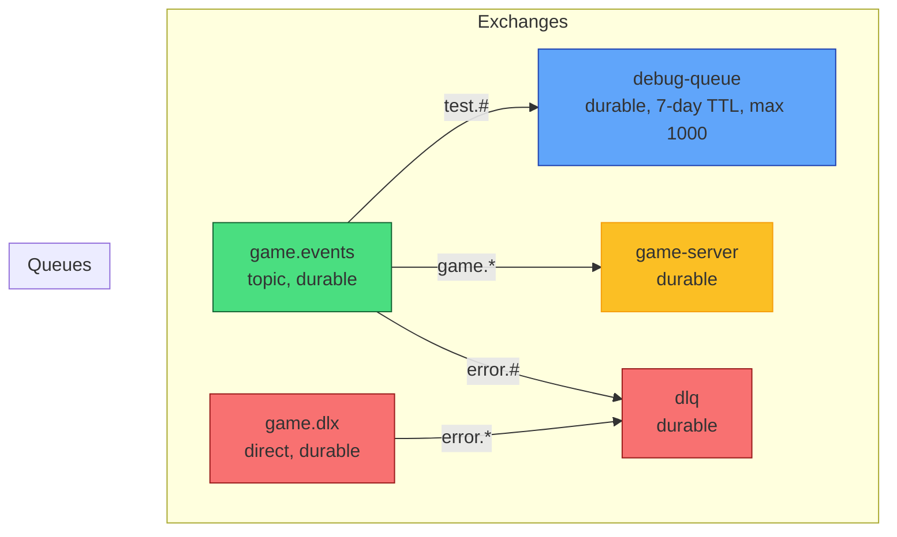

# RabbitShip ⚓ Real-Time Battleship with RabbitMQ

**No frameworks. Raw `amqplib`. AI + Multiplayer. 6 dependencies.**

- AI uses **Hunt/Target + Parity** (wins in ~64 moves)
- Multiplayer: 2 browsers, instant sync
- All communication via **RabbitMQ pub/sub**
- Live demo: https://rabbitship.onrender.com

## Run Locally

```bash
docker compose up --build
```

## Architecture

RabbitMQ setup diagram:



File structure:

```
src/
├── server/
│   ├── game/
│   │   ├── types.ts          ← ONLY types/interfaces
│   │   ├── board.ts          ← ship placement logic
│   │   ├── shot.ts           ← shot resolution
│   │   ├── ai.ts             ← AI brain
│   │   ├── engine.ts         ← main GameEngine class
│   │   └── index.ts          ← barrel export
│   ├── rabbit/
│   │   ├── constants.ts
│   │   ├── connection.ts
│   │   ├── setup.ts
│   │   ├── publisher.ts
│   │   ├── consumer.ts
│   │   └── index.ts
│   └── http/
│       └── server.ts
└── ws/
    └── server.ts
```
