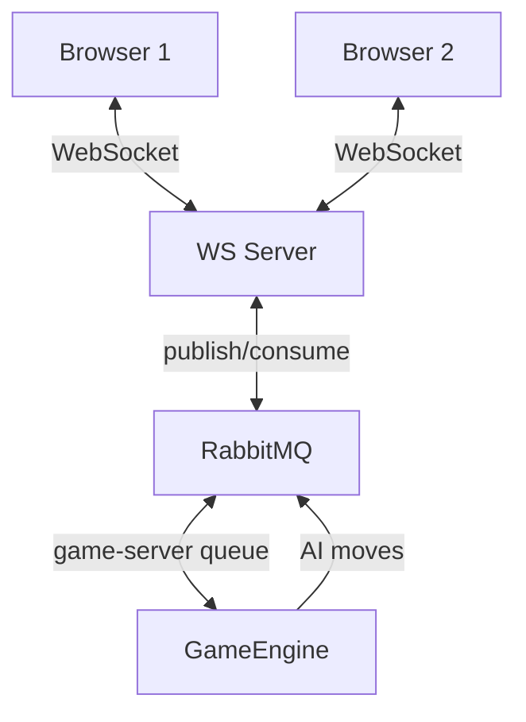

# RabbitShip ⚓ Real-Time Battleship with RabbitMQ

**No frameworks. Raw `amqplib`. AI + Multiplayer. 6 dependencies.**

- AI uses **Hunt/Target + Parity** (wins in ~64 moves)
- Multiplayer: 2 browsers, instant sync
- All communication via **RabbitMQ pub/sub**
- Live demo: https://rabbitship.onrender.com

## Run Locally

```bash
docker compose up --build
```

## Architecture


