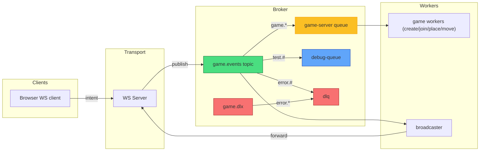

# RabbitShip ⚓ Real-Time Battleship with RabbitMQ

RabbitShip is a message-driven real-time multiplayer battleship game using RabbitMQ for pub/sub messaging and WebSockets for client communication.

## Core Architecture

The system follows a microservices pattern with these key components:

1. HTTP Server - Entry point and static file serving
2. WebSocket Server - Real-time client communication (src/server/ws/)
3. RabbitMQ Message System - Event pub/sub backbone (src/server/rabbit/)
4. Worker Handlers - Business logic processors (src/server/worker/)
5. Game Engine - Game state management (src/game/)

## Event Flow Pattern

Client → Server → Worker → Client:

1. Client sends WebSocket message
2. WS server validates → publishes to RabbitMQ
3. RabbitMQ routes to appropriate worker queue
4. Worker processes business logic
5. Worker publishes result event
6. Broadcaster forwards to relevant WebSocket clients

RabbitMQ setup diagram:



## Key Architecture Features

**Message System (src/server/rabbit/):**

- Topic exchange with wildcard routing (game.\*, error.#)
- MessagePack serialization for efficient binary payloads
- Publisher confirms guaranteeing delivery
- Dead letter queues for failed messages
- Singleton connection with auto-reconnection

**WebSocket Integration (src/server/ws/):**

- Unique WS ID assignment and game mapping
- Input validation for all payloads
- Exclusive broadcaster queue for real-time updates

**Worker Processing (src/server/worker/):**

- Game Worker - Game creation/joining
- Placement Worker - Ship placement validation
- Move Worker - Shot resolution and game logic
  This design provides excellent scalability, reliability, and real-time performance through proper separation of concerns and message-driven architecture.

## Run Locally

```bash
docker compose up --build
```

### Quick Dev Run (recommended)

Prereqs: Docker (for RabbitMQ) and Bun (server runtime). Node/npm for client build.

1. Start RabbitMQ:

```bash
docker-compose up -d rabbitmq
# visit RabbitMQ UI: http://localhost:15672 (guest/guest)
```

2. Install dependencies (client/tools):

```bash
npm install
```

3. Start the server (Bun):

```bash
npm run server
# or: bun run src/server/http/server.ts
```

4. Start the client dev server (optional):

```bash
npm run dev
# open http://localhost:3000
```

Notes:

- WebSocket endpoint: `ws://localhost:8080`.
- If running via Docker Compose the `app` service will be built and started and already points RabbitMQ at the `rabbitmq` service.
